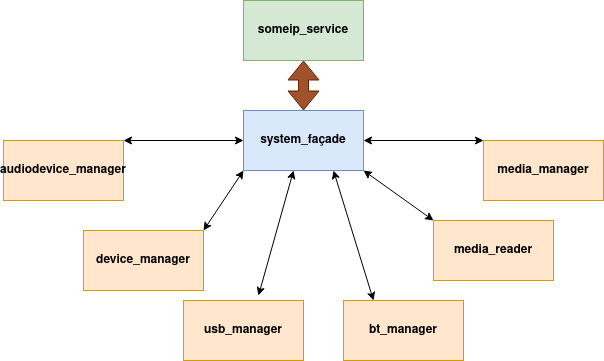
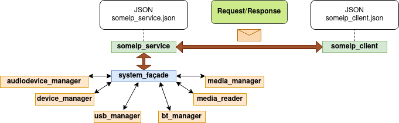
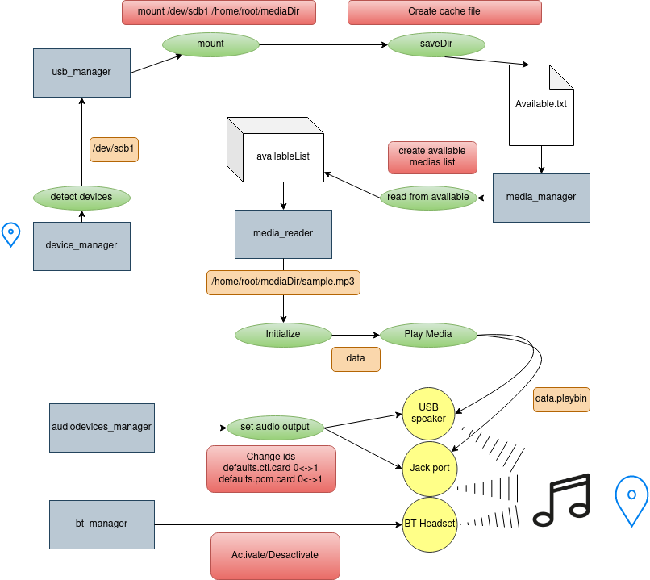
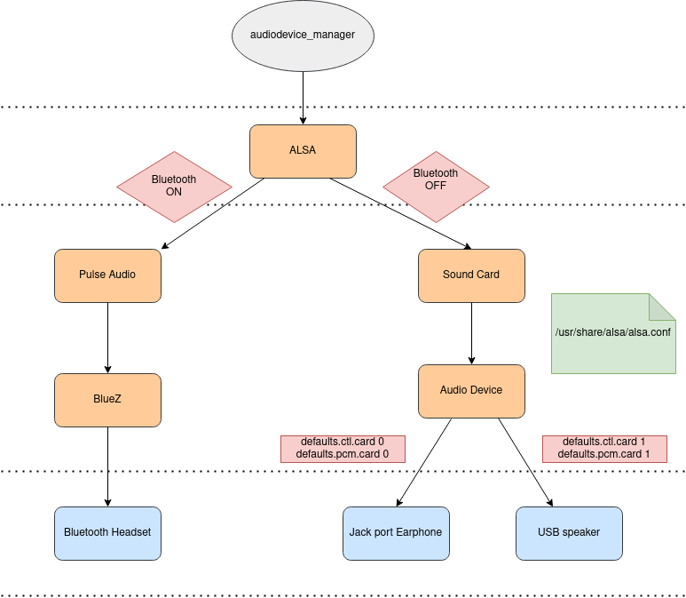

# Gstreamer.SomeIP.Media.Reader

This is a SomeIP service that provides a group of functionalities to interact with audio files and with the hosting system of the service.

 - This service manage the communication with different classes in the hosting system:

    **1- audiodevices_manager:**
        AudioDevices_manager class is a micro service that controls and returns 
        the possible audio output devices.

    **2- devices_manager:**
        This class return the name of the detected usb device.

    **3- usb_manager:**
        usb_manager class is the class responsible of the interaction between the
        usb device and the hosting system.

    **4- bt_manager:**
        bt_manager class is responsible for the interaction with Bluetooth output devices.

    **5- media_manager**
        media_manager class is the class responsible of managing the medias in
        the usb stick and it also interacts with cache and playlists.

    **6- media_reader:**
        media_reader class is the class responsible of reading a media and of controling 
        the media status.

- The communication with these classes and their methods is made via one of the most important elements of the design pattern world the **"system_façade"**: system_facade class is the class responsible of hiding the complexities of the system and provides a simpler interface to the client. It is a single wrapper class that contains a set of members required by the client. These members access the system on behalf of the facade client and hide the implementation details. 

 
***************************************************************************************************************************************
***************************************************************************************************************************************
***************************************************************************************************************************************

Our someip service offers an instance of a service interface that a client will use to call methods of the classes mentionned above.
Methods are called via RPC calls using **Methods IDs** these are the callable methods:

| on_messageX    |  Mothod ID  |  Class   |   Method  |
| ------    | ------    | ------    | ------    |
| 001  | 0x0001  | media_manager  | read from history |
| 002  | 0x0002  | media_manager  | read from favourite |
| 003  | 0x0003  | media_manager  | read from available |
| 004  | 0x0004  | media_manager  | set current playlist + payload(int) |
| 005  | 0x0005  | media_manager  | get media with index + payload(int) |
| 006  | 0x0006  | media_manager  | find media + payload(string) |
| 007  | 0x0007  | media_manager  | add media to favourite + payload(string) |
| 008  | 0x0008  | media_manager  | delete media from favourite(string) |
| ########  | ######  | ################  | ########################################|
| 101  | 0x0101  | media_reader  | Initialize + payload(string) |
| 102  | 0x0102  | media_reader  | Start playing |
| 103  | 0x0103  | media_reader  | get current time |
| 104  | 0x0104  | media_reader  | volume up |
| 105  | 0x0105  | media_reader  | volume down |
| 106  | 0x0106  | media_reader  | shut down |
| 107  | 0x0107  | media_reader  | Play/Pause |
| 108  | 0x0108  | media_reader  | get media length |
| ########  | ######  | ################  | ########################################|
| 201  | 0x0201  | device_manager  | detect USB devices |
| ####  | ######  | ################  | ########################################|
| 301  | 0x0301  | usb_manager  | mount USB device + payload(string) |
| 302  | 0x0302  | usb_manager  | unmount USB device + payload(string) |
| 303  | 0x0303  | usb_manager  | create cache + payload(string) |
| 304  | 0x0304  | usb_manager  | delete cache |
| ########  | ######  | ################  | ########################################|
| 401  | 0x0401  | audiodevice_manager  | get output audio devices |
| 402  | 0x0402  | audiodevice_manager  | set output audio device + payload(string) |
| ########  | ######  | ################  | ########################################|
| 501  | 0x0501  | bt_manager  | connect + payload(string) |
| 502  | 0x0502  | bt_manager  | disconnect + payload(string) |
| 503  | 0x0503  | bt_manager  | scan on  |
| 504  | 0x0504  | bt_manager  | scan off  |
| 505  | 0x0505  | bt_manager  | power on  |
| 506  | 0x0506  | bt_manager  | power off  |
| 507  | 0x0507  | bt_manager  | pair + payload(string) |
| 508  | 0x0508  | bt_manager  | remove + payload(string) |
| 509  | 0x0509  | bt_manager  | trust + payload(string) |
| 510  | 0x0510  | bt_manager  | untrust + payload(string) |
| 511  | 0x0511  | bt_manager  | devices  |
| 512  | 0x0512  | bt_manager  | info + payload(string) |
| 513  | 0x0513  | bt_manager  | agent on + payload(string) |
| 514  | 0x0514  | bt_manager  | agent off + payload(string) |
| 515  | 0x0515  | bt_manager  | get scanned devices  |

#**Useful informations**

To insure communication between a client and our service it is necessary to write a vsomeip configuration file.

The configuration file is a json format file (check this link to learn more about json [text](http://www.json.org/) )

The standard folder for the json files is /etc/vsomeip. However we recommend linking your client and our service manually by setting the environment variable VSOMEIP_CONFIGURATION.

It is also possible to copy the configuration file to the folder which contains the executable application (local configuration).

Finally, please change ,the unicast address in our json "someip_service.json" according to the hosting machine IP address.

To link the configuration file to the executable:

```export VSOMEIP_CONFIGURATION=/path/to/someip_service.json```

```export VSOMEIP_APPLICATION_NAME=/path/to/executable```

To configure routing address&mask:

```sudo route add -net 224.0.0.0/3 dev eth0```

#**Global design**

 

***************************************************************************************************************************************
***************************************************************************************************************************************
***************************************************************************************************************************************

#**Inside our service:**

 

***************************************************************************************************************************************
***************************************************************************************************************************************
***************************************************************************************************************************************

#**High-level design of the Linux Sound Architecture for audio streaming**


 

***************************************************************************************************************************************
***************************************************************************************************************************************
***************************************************************************************************************************************
#**Gstreamer library installation**

Run the following command:

```apt-get install libgstreamer1.0-dev libgstreamer-plugins-base1.0-dev libgstreamer-plugins-bad1.0-dev gstreamer1.0-plugins-base gstreamer1.0-plugins-good gstreamer1.0-plugins-bad gstreamer1.0-plugins-ugly gstreamer1.0-libav gstreamer1.0-doc gstreamer1.0-tools gstreamer1.0-x gstreamer1.0-alsa gstreamer1.0-gl gstreamer1.0-gtk3 gstreamer1.0-qt5 gstreamer1.0-pulseaudio```


#**SOME/IP Build Instructions for Linux**

Dependencies:

A C++11 enabled compiler like gcc >= 4.8 is needed.
vsomeip uses CMake as buildsystem.
vsomeip uses Boost >= 1.55:

```sudo apt-get install libboost-system1.55-dev libboost-thread1.55-dev libboost-log1.55-dev```

To build the documentation asciidoc, source-highlight, doxygen and graphviz is needed:

```sudo apt-get install asciidoc source-highlight doxygen graphviz```

Cloning the project:

```git clone https://github.com/COVESA/vsomeip.git```

Compilation:

```mkdir build```

```cd build```

```cmake ..```

```make```

To specify a installation directory (like --prefix= if you're used to autotools) call cmake like:

```cmake -DCMAKE_INSTALL_PREFIX:PATH=$YOUR_PATH ..```

```make```

```make install```


***************************************************************************************************************************************
***************************************************************************************************************************************
***************************************************************************************************************************************


